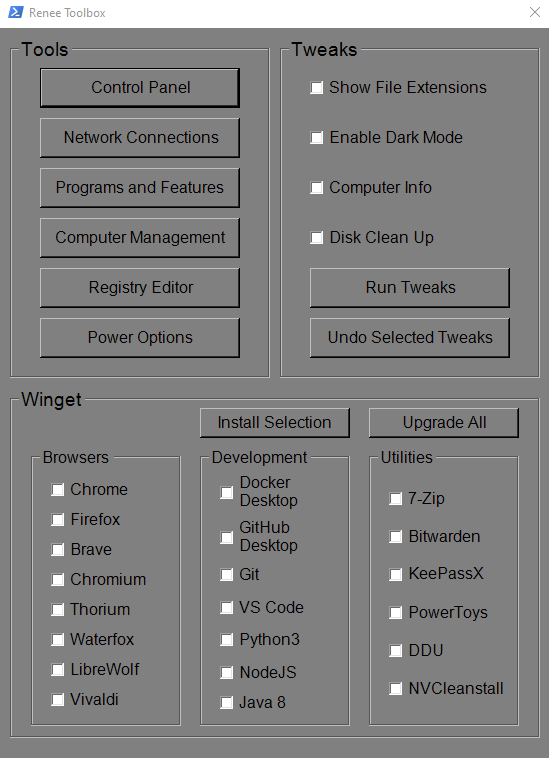

> [!CAUTION]
> Most likely outdated & has not been tested in Windows 11

# Renee-ToolBox

I've put together this utility for swift access to various Windows components. It also allows you to effortlessly tweak some simple settings and conveniently install software using the Winget tool.



## Usage:

Requires you to launch PowerShell or Windows Terminal As **ADMINISTRATOR!** 
The recommended way is to right-click on the start menu and select (PowerShell As Admin *Windows 10* - Windows Terminal As Admin *Windows 11*)

Launch Command:

```
iwr -useb raw.githubusercontent.com/Droxx-y/Renee-ToolBox/main/Renee_Toolbox.ps1 | iex
