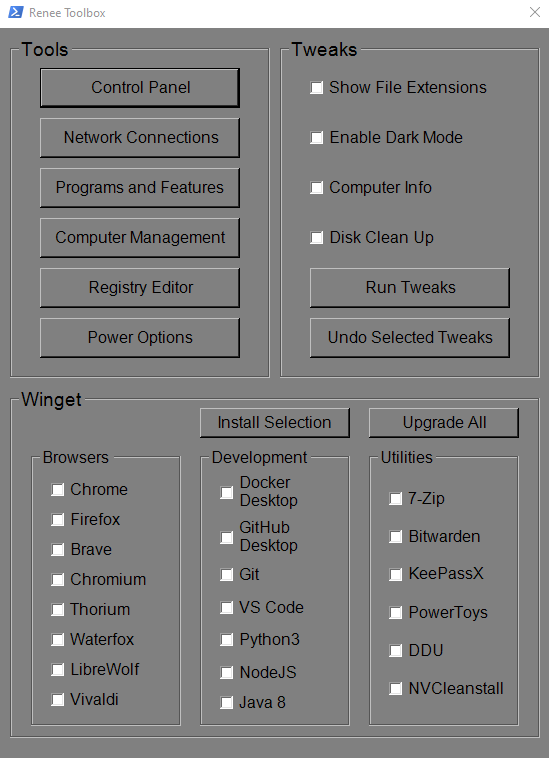

# Renee-ToolBox

I've put together this utility to simplify installs with handy tools, fine-tune system settings with tweaks, and effortlessly handle software installations using Winget.



## Usage:

Requires you to launch PowerShell or Windows Terminal As **ADMINISTRATOR!** 
The recommended way is to right-click on the start menu and select (PowerShell As Admin *Windows 10* - Windows Terminal As Admin *Windows 11*)

Launch Command:

```
iwr -useb https://christitus.com/win | iex
```
